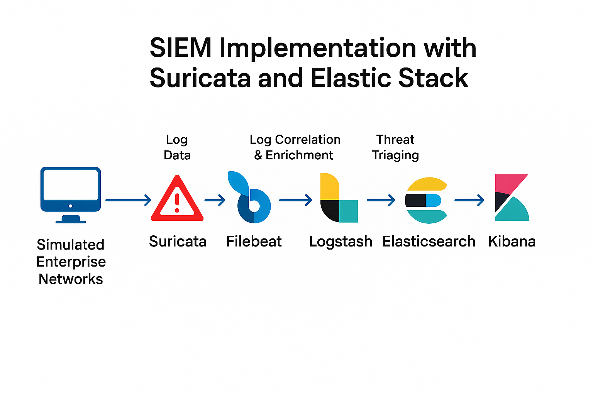

# 🛡️ SIEM Implementation with Suricata & ELK Stack

## 📌 Overview
This project showcases a full SIEM pipeline built using Suricata IDS and the Elastic Stack (Filebeat, Logstash, Elasticsearch, Kibana). It was designed to detect and triage security events in real time across simulated enterprise network environments.

## 🎯 Objectives
- Real-time detection of threats using Suricata and Elastic Stack
- Noise reduction through MITRE ATT&CK mapped Suricata rules
- Automated log enrichment and alerting workflows

## 🛠️ Stack
- **Suricata IDS** – for network-based threat detection
- **Elastic Stack (ELK)** – for centralized log management
  - Filebeat – forwarding logs from Suricata
  - Logstash – log transformation and enrichment
  - Elasticsearch – log indexing and querying
  - Kibana – visualization and alerting

## ⚙️ Architecture

## 📁 Key Features
- 🧠 High-fidelity Suricata rules (mapped to MITRE ATT&CK)
- 🔄 Automated enrichment: GeoIP, whois, user-agent parsing
- 🚨 X-Pack based alerting for brute force, scanning, and RCE attempts
- 🧪 Attack simulation scripts for detection validation

## 📊 Dashboards
- Network Reconnaissance
- Suspicious Logins
- Exploit Attempts by IP & Technique

## 🚀 Getting Started
1. Clone the repo
2. Spin up services using Docker or native installs
3. Simulate attacks using `simulate-attacks.sh`
4. View detections and dashboards in Kibana

## 📜 MITRE Techniques Covered
- T1046: Network Service Scanning
- T1110: Brute Force
- T1190: Exploit Public-Facing Application

## 👨‍💻 Author
Kamalesh Jayapandiaraj – [LinkedIn](https://www.linkedin.com/in/kamalesh-jayapandiaraj-arumugam/) | [Email](karumuga@usc.edu)

